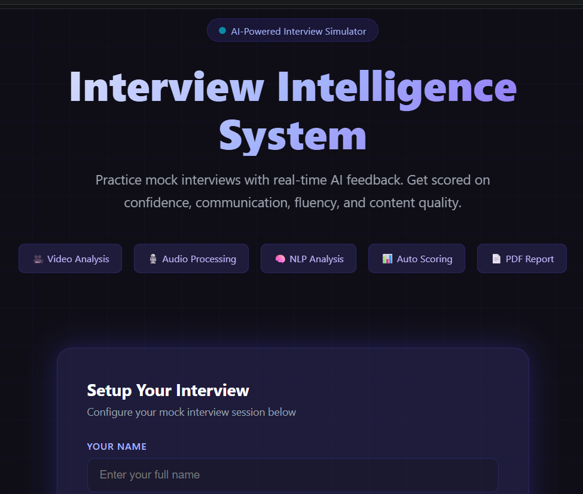
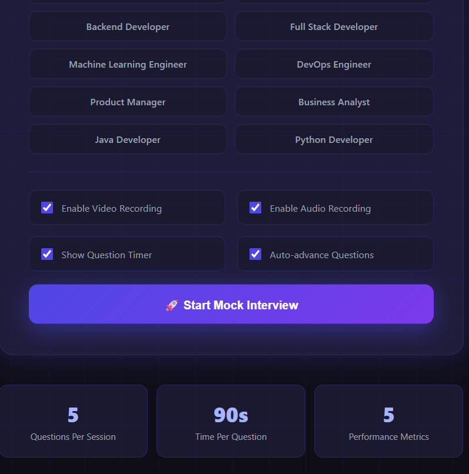
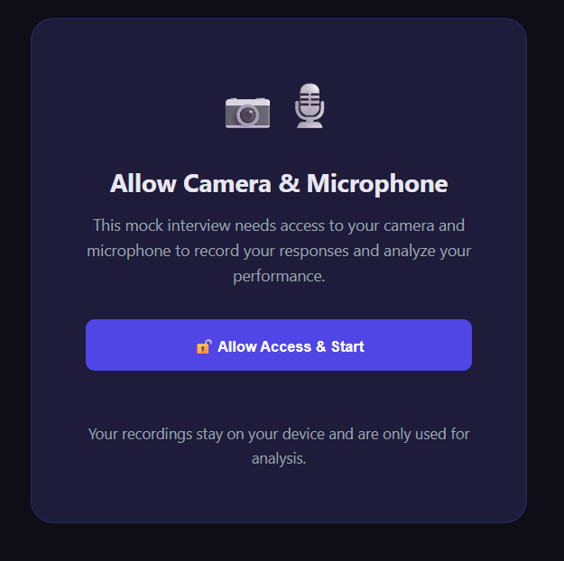
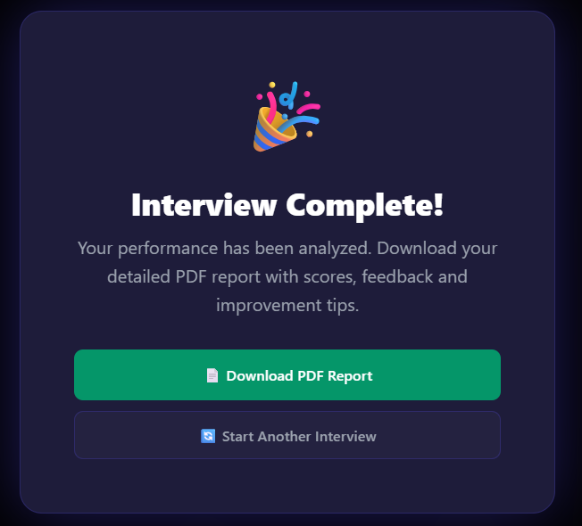

# 🎤 Interview Intelligence System

An AI-powered mock interview platform that evaluates communication skills using real-time video analysis, audio processing, NLP techniques, automated scoring, and PDF performance reporting.

---

## 📸 Application Preview

### 🏠 Home Page


### 🎯 Interview Setup


### 📷 Camera & Microphone Permission


### 🎙️ Live Interview Session


### 📊 Interview Progress & Live Analysis


### 🎉 Interview Completed


### 📄 Performance Report


### 📄 Detailed Recommendations


---

# 🚀 Quick Start

## Step 1 — Clone the Repository

```bash
git clone https://github.com/Harini-Nagireddy/Interview-Intelligence-System.git
```

---

## Step 2 — Install Dependencies

```bash
python -m pip install -r requirements.txt
```

---

## Step 3 — Run the Application

```bash
python app.py
```

You should see:

```
* Running on http://127.0.0.1:5000
```

---

## Step 4 — Open in Browser

```
http://localhost:5000
```

---

# 🎯 How to Use

1. Enter your name.
2. Select your desired job role.
3. Configure interview options.
4. Click **Start Mock Interview**.
5. Allow camera and microphone access.
6. Answer all interview questions.
7. Review your performance.
8. Download the PDF evaluation report.

---

# ✨ Key Features

- ✅ AI-powered mock interview simulation
- ✅ 12 role-specific interview tracks
- ✅ Real-time speech-to-text transcription
- ✅ Camera & microphone recording
- ✅ Live confidence and fluency analysis
- ✅ Eye contact tracking
- ✅ Communication quality evaluation
- ✅ Countdown timer for every question
- ✅ Automatic interview scoring
- ✅ Personalized improvement suggestions
- ✅ Professional PDF performance report
- ✅ Fully offline (No paid AI APIs required)

---

# 📊 Performance Metrics

The system evaluates candidates based on multiple communication and behavioral parameters.

| Metric | Description |
|---------|-------------|
| 🎯 Confidence | Camera presence, pauses, speaking confidence |
| 💬 Communication | Sentence quality, vocabulary and clarity |
| 👁 Eye Contact | Estimated camera engagement |
| 🗣 Fluency | Speaking speed, silence ratio and filler words |
| 📝 Content Quality | Technical relevance and answer completeness |

---

# 🛠 Tech Stack

## Backend

- Python
- Flask

## Frontend

- HTML5
- CSS3
- JavaScript

## Browser APIs

- MediaRecorder API
- Web Speech API
- Canvas API

## PDF Generation

- ReportLab

---

# 📂 Project Structure

```
Interview_Intelligence/
│
├── modules/
│   ├── question_bank.py
│   ├── video_analysis.py
│   ├── audio_analysis.py
│   ├── speech_analysis.py
│   ├── scoring.py
│   └── report_generator.py
│
├── templates/
│   ├── index.html
│   └── interview.html
│
├── static/
├── screenshots/
├── reports/
├── uploads/
│
├── app.py
├── requirements.txt
└── README.md
```

---

# 📌 Supported Interview Roles

- Software Engineer
- Data Analyst
- Data Scientist
- Frontend Developer
- Backend Developer
- Full Stack Developer
- Machine Learning Engineer
- DevOps Engineer
- Product Manager
- Business Analyst
- Java Developer
- Python Developer

---

# 📄 Generated PDF Report Includes

- Overall Performance Score
- Confidence Score
- Communication Score
- Fluency Score
- Engagement Score
- Content Quality Score
- Question-wise Analysis
- Strengths
- Areas for Improvement
- Personalized Recommendations

---

# 🔧 Troubleshooting

### Camera Not Working

- Allow browser permissions.
- Close other applications using the camera.

---

### Speech Recognition Not Working

Use:

- Google Chrome
- Microsoft Edge

---

### Installation Errors

Run:

```bash
python -m pip install -r requirements.txt
```

---

### Port Already in Use

Change:

```python
port=5000
```

to

```python
port=5001
```

inside **app.py**.

---

# 🎯 Future Scope

- Resume-based interview questions
- Emotion detection
- AI-generated feedback
- Performance history dashboard
- Multi-language interview support

---

# 👩‍💻 Author

**Harini Nagireddy**

Final Year B.Tech (Data Science)

Passionate about AI, Machine Learning, Data Science, and Software Development.

---

# 📜 License

This project was developed as an academic and portfolio project for educational and demonstration purposes.